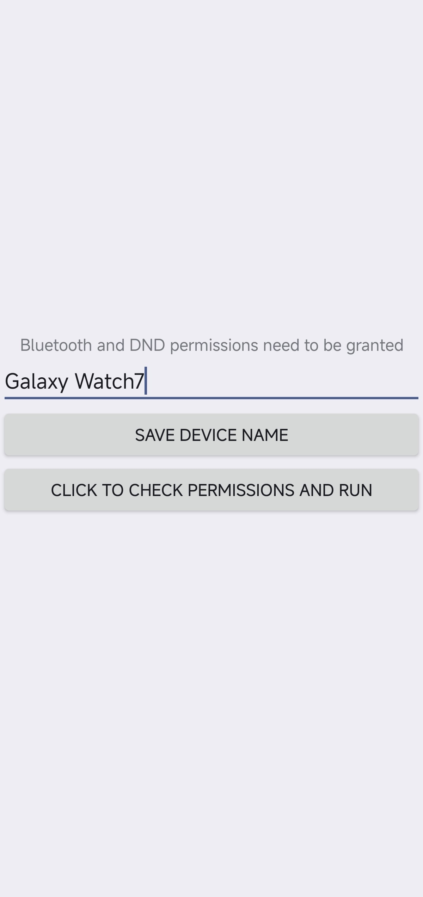
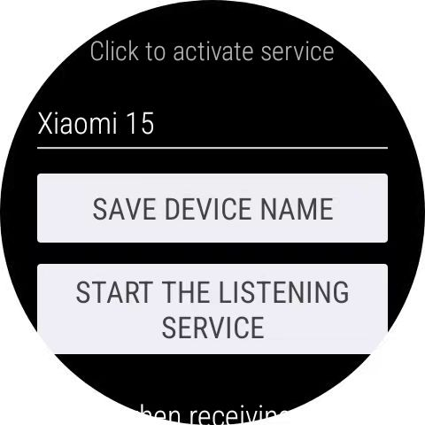

# WearOS DND Sync

**[English](#english) | [中文](#chinese)**

---

<a name="english"></a>
## 🇬🇧 English

**A bidirectional Do Not Disturb (DND) synchronization tool for Android phones and Wear OS smartwatches.**

* **No Brand Restriction:** The phone and watch do not need to be the same brand.
* **Bidirectional:** Toggle DND on either device, and the other will sync automatically.
* **Offline:** Uses native Bluetooth (RFCOMM) communication; no internet connection required.

**Tested Devices:**
* **Phone:** Xiaomi 15 (China Ver., HyperOS 3)
* **Watch:** Samsung Galaxy Watch 7 (China Ver., OneUI 8)

<p align="center">
  
  &nbsp; &nbsp; &nbsp; &nbsp;
  
</p>

### How to Use

#### 1. Phone Setup
1.  Install `app-phone.apk`.
2.  **Grant Permissions:** Click "Check Permissions". You need to grant:
    * **Nearby Devices (Bluetooth):** To connect to the watch.
    * **DND Access (Notification Policy):** To read and modify DND status.
    * **Notifications (Optional):** To show the foreground service status.
3.  **Set Target Name (Optional):** Enter a keyword for your watch's Bluetooth name. Ensure that the keyword is unique across all paired devices(e.g., `Galaxy Watch`) and click "Save".
    * *Note:* If left empty, the app will try to connect to all paired devices running this app, which may cause slow synchronization.
4.  **Start Service:** Click "Start Service". A "DND Sync Running" notification should appear in the status bar (some models might not show this).
5.  **⚠️ (Important) Prevent Background Killing:**
    * **Enable Accessibility Service:** Go to your phone's **Settings -> Accessibility -> Downloaded Apps**, find **"DND Sync Keep Alive"** (or similar name), and enable it.
    * This ensures the app is not killed by the system in the background.

#### 2. Watch Setup
1.  Install `app-watch.apk` via ADB.
2.  **Grant DND Permission via ADB:** Since the system UI for granting DND access is hidden on some watches, you must run the following ADB command:
    ```bash
    adb shell cmd notification allow_dnd com.example.dndsync
    ```
    *(Note: If you changed the package name, please replace `com.example.dndsync` with your actual package name)*
3.  Open the app and grant other necessary permissions.
4.  **Set Target Name:** Enter a keyword for your phone's Bluetooth name (e.g., `Xiaomi` or `Pixel`) and save.
5.  Click "Start Service".

---

<a name="chinese"></a>
## 🇨🇳 中文

**Android 手机与 Wear OS 手表勿扰模式的双向同步工具。**

* **无品牌限制：** 手机与手表无需相同品牌即可使用。
* **双向同步：** 在任意一端开启勿扰，另一端会自动同步。
* **离线运行：** 本应用使用原生蓝牙 (RFCOMM) 通信，不需要互联网连接。

**测试设备：**
* **手机：** 国行小米15 (HyperOS 3)
* **手表：** 国行三星 Galaxy Watch7 (OneUI 8)

### 使用方法

#### 1. 手机端设置
1.  安装 `app-phone.apk`。
2.  **授权：** 点击“检查权限并启动服务”。你需要授予：
    * **附近的设备 (蓝牙)：** 用于连接手表。
    * **勿扰权限 (通知使用权)：** 用于读取和修改勿扰状态。
    * **通知权限 (可选)：** 用于显示前台服务状态。
3.  **设置目标名称 (可选)：** 输入你手表蓝牙名称的关键词，确保该关键词是所有已配对设备唯一的（例如 `Galaxy Watch`），然后点击“保存设备名”。
    * *注意：* 如果留空，它将尝试连接所有安装了此 App 的配对设备，可能导致同步速度变慢。
4.  **启动服务：** 点击按钮启动服务，通知栏应出现“DND Sync 正在运行”的提示（部分机型可能不会显示，但这不影响功能）。
5.  **⚠️ (重要) 防杀后台设置：**
    * **开启无障碍保活：** 前往手机的 **设置 -> 更多设置 -> 无障碍 -> 下载的应用**，找到 **"DND Sync 保活服务"** 并开启。
    * 这能确保 App 在后台不被系统杀掉，保证同步稳定。

#### 2. 手表端设置
1.  通过 ADB 安装 `app-watch.apk`。
2.  **通过 ADB 授予勿扰权限：** 由于部分手表系统屏蔽了勿扰权限的授权界面，必须运行以下 ADB 命令手动授权：
    ```bash
    adb shell cmd notification allow_dnd com.example.dndsync
    ```
3.  打开应用，同样授予其他必要的权限。
4.  **设置目标名称：** 输入你手机蓝牙名称的关键词（例如 `Xiaomi` 或 `Pixel`）并保存。
5.  点击“启动服务”。
